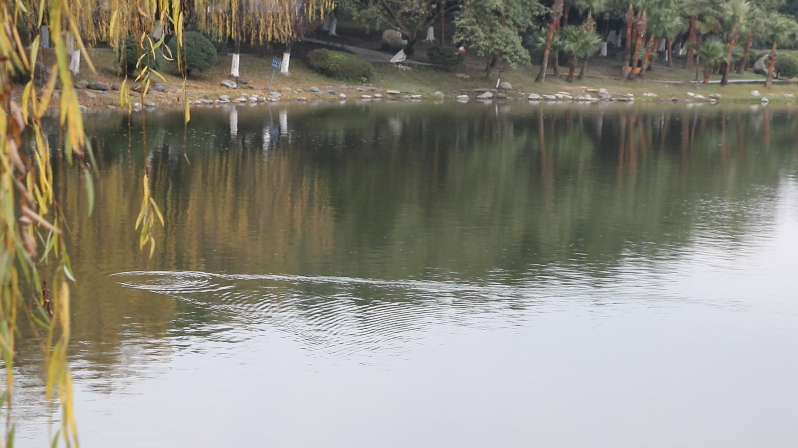

“如果提前了解了你们的人生，不知你们是否还会有勇气前来？”

<!-- more -->

------

再想起这句台词，电影都不知是何日看的了，挺早的。

我想说，有啊，就是少点。

2018-2019的交界时，立了好多flag，还试着跟一波朋友圈网易云音乐flag的热潮，无奈轰趴的那个夜晚，明明显示着长按保存，我却怎么样都唤不出菜单。怎么回事？谁知道呢。我只知道，最后我放弃了，只在总结里添了一行信号微弱的粗浅论调。熬夜的后遗症还在，大致就是睡不醒醒就睡，萎靡着，空洞着，压缩着吃饭、喝水等等一切行动的欲望来恢复精力。

打卡到最后几个眼神都是迷离的，隐隐听着音响里的歌，再也不循环那个熟悉的、混杂的歌单了，随便什么，有声音就好，不是神曲就好，一个人的世界里，它们都有自己的声音。

喜欢美短，想取个名字叫辛巴(Simba)，而所有的不喜欢和不知道，是还没准备好。

出门就是一场义无反顾的冒险，不消多远，上厕所都赶时间，怕残羹被收走。相信世间温暖，禁不住旁人冷漠，观察得更多，想得更多，连绝对不常用的“plover”都变得难以忘记，才发现所谓的幸运四叶草，也只不过是“four-leaf clover”（四叶的三叶草）而已。

幸好，镜头下死水微澜，是小野鸭在凫水。

不要等风来，跑起来，它就奔向了你。