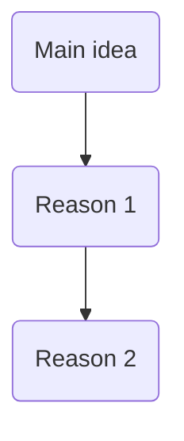

新托福口语答题模板总结。

<!-- more -->

### TASK 1

Template:

> When ..., I'd .../Well honestly, I (dis)agree with the idea.
>
> The most obvious reason is that + sub idea 1.
>
> In my case/Take my own experience for example, ...
>
> Another reason is that + sub idea 2.
>
> To be more specific/Specifically speaking,...
>
> (Those are the reasons why I am for/against the idea.)

### TASK 2

Template:

> UNIV：
>
> - The university is going to/announces that...because/in order to...
>
> S/T：
>
> - A student/teacher suggests university should...because/in order to...
>
> The man/woman (dis)agrees with the idea.
>
> He/She says that...
>
> 
>
> 

### TASK 3

Template:

>The passage defines X as n. that...
>
>The professor elaborates on this with an example.
>
>...