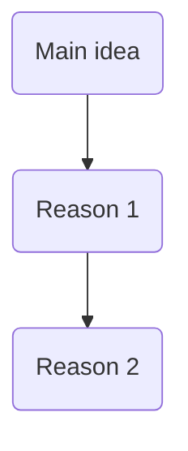

### TASK 1

Template:

> When ..., I'd .../Well honestly, I (dis)agree with the idea.
>
> The most obvious reason is that + sub idea 1.
>
> In my case/Take my own experience for example, ...
>
> Another reason is that + sub idea 2.
>
> To be more specific/Specifically speaking,...
>
> (Those are the reasons why I am for/against the idea.)

